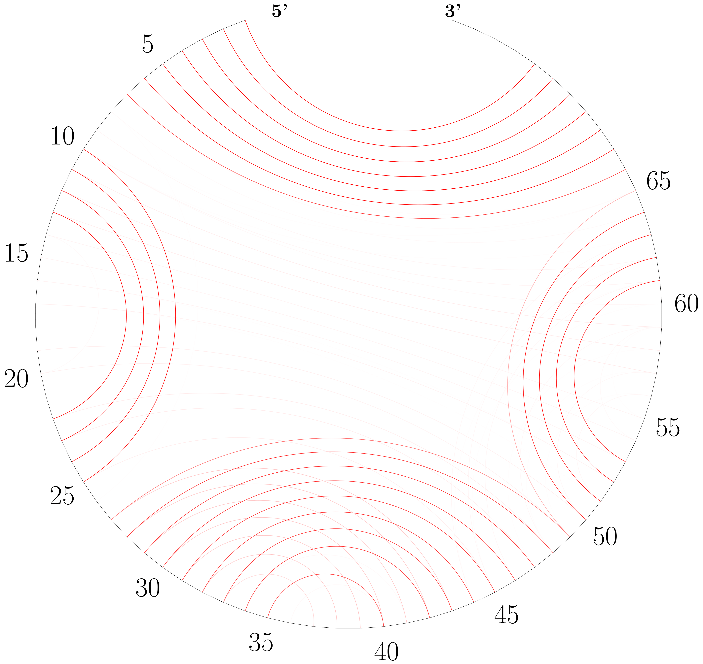
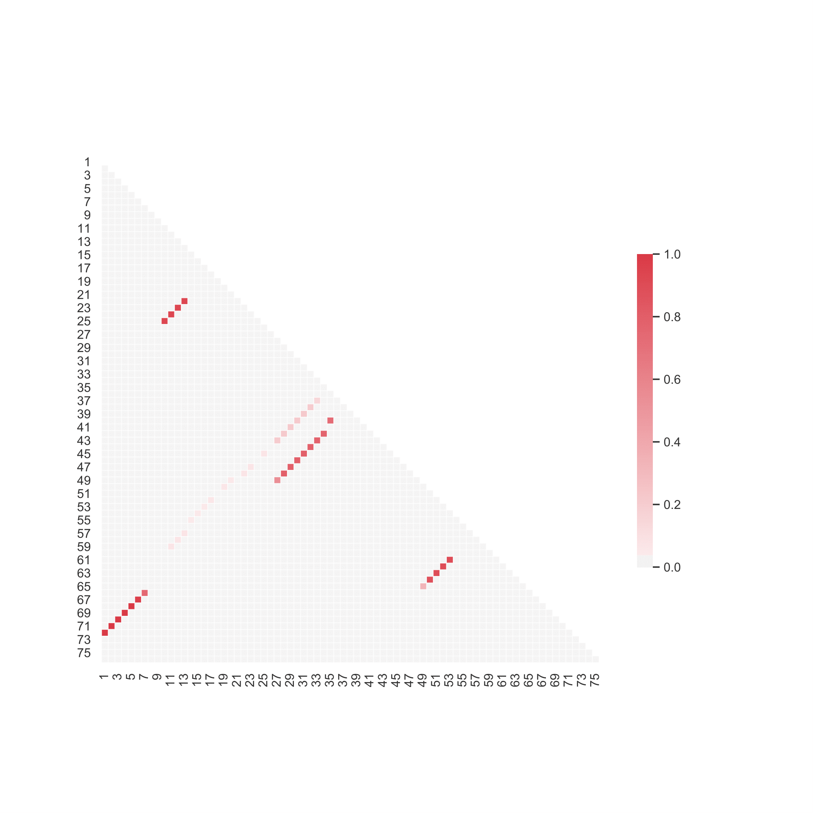

# LinearPartition: Linear-Time Approximation of RNA Folding Partition Function and Base Pairing Probabilities

This repository contains the C++ source code for the LinearPartition project, the first linear-time partition function and base pair probabilities calculation algorithm/software for RNA secondary structures.

[LinearPartition: linear-time approximation of RNA folding partition function and base-pairing probabilities](https://academic.oup.com/bioinformatics/article/36/Supplement_1/i258/5870487). Bioinformatics, Volume 36, Issue Supplement_1, July 2020, Pages i258–i267. ISMB 2020

He Zhang, Liang Zhang, David Mathews, Liang Huang*

\* corresponding author

Web server: http://linearfold.org/partition


## Dependencies
gcc 4.8.5 or above; 
python2.7
LaTex for drawing circular plot
numpy, pandas, seaborn and matplotlib for drawing heatmap plot

## To Compile
```
make
```

## To Run
LinearPartition can be run with:
```
echo SEQUENCE | ./linearpartition [OPTIONS]

OR

cat SEQ_OR_FASTA_FILE | ./linearpartition [OPTIONS]
```
Both FASTA format and pure-sequence format are supported for input.

OPTIONS:
```
--beamsize BEAM_SIZE or -b BEAM_SIZE 
```
The beam size (default 100). Use 0 for infinite beam.
```
--Vienna or -V
```
Switches LinearPartition-C (by default) to LinearPartition-V.
```
--fasta
```
Specify that the input is in fasta format. (default FALSE)
```
--verbose
```
Prints out beamsize, Log Partition Coefficient or free energy of ensemble (-V mode) and runtime information. (default False)
```
--sharpturn
```
Enable sharpturn. (default False)
```
--output FILE_NAME or -o FILE_NAME
```
Outputs base pairing probability matrix to a file with user specified name. (default False)
```
--rewrite FILE_NAME or -r FILE_NAME
```
Output base pairing probability matrix to a file with user specified name (overwrite if the file exists). (default False)
```
--prefix PREFIX_NAME
```
Outputs base pairing probability matrices to files with user specified prefix. (default False)
```
--part or -p
```
Partition function calculation only. (default False)
```
--cutoff CUTOFF or -c CUTOFF
```
Only output base pair probability larger than user specified threshold (CUTOFF) between 0 and 1. (DEFAULT=0.0)
```

--dumpforest or -f
```
dump forest (all nodes with inside [and outside] log partition functions but no hyperedges) for downstream tasks such as sampling and accessibility (DEFAULT=None)

```
--mea or -M
```
get MEA structure, (DEFAULT=FALSE)

```
--gamma GAMMA or -g GAMMA
```
set MEA gamma, (DEFAULT=3.0)

```
--bpseq
```
output MEA structure(s) in bpseq format instead of dot-bracket format

```
--mea_prefix
```
output MEA structure(s) to file(s) with user specified prefix name

```
--threshknot or -T
```
get ThreshKnot structure, (DEFAULT=FALSE)

```
--threshold <FILE_NAME>
```
set ThreshKnot threshknot, (DEFAULT=0.3)

```
--threshknot_prefix
```
output ThreshKnot structure(s) to file(s) with user specified prefix name (default False)

```
--shape FILE_NAME
```
use SHAPE reactivity data (for -V mode only)  
Please refer to this link for the SHAPE data format:
https://rna.urmc.rochester.edu/Text/File_Formats.html#SHAPE

```
--evaly y
```
prints p(y | x) and -kT log Q(x), e.g.,
```
$ echo -ne "CCCAAAGGG" | ./linearpartition -V --evaly "(((...)))"
CCCAAAGGG
Free Energy of Ensemble: -1.41344 kcal/mol
x= CCCAAAGGG	y= (((...)))	DeltaG(x,y)= -1.20	-kTlogQ(x)= -1.41344	p(y|x)= 0.70729
```
Note that this mode can be used in batch mode where you evaluate `p(y|x)` for many `x` sequences and a particular `y` structure.


## To Visualize 
LinearPartition provides two ways to visualize base pairing probabilities, circular plot and heatmap plot.

In a circular plot, the darkness of each arc represents the probability of each base pair (see an example below). 
To draw a circular plot, run command:  
```
cat TARGET_FILE | ./draw_bpp_plot BASE_PAIRING_PROBABILITY_FILE
```
TARGET_FILE contains one sequence and its structure; see "ecoli_tRNA" file as an example.
BASE_PAIRING_PROBABILITY_FILE can be a probability file generated by LinearPartition, or a file with the same format; see "ecoli_tRNA_bpp" as an example.

To draw a heatmap plot, run command:  
```
cat BASE_PAIRING_PROBABILITY_FILE | ./draw_heatmap SEQUENCE_LENGTH
```
SEQUENCE_LENGTH is the length of the sequence.

## Example: Run Predict
```
cat testseq | ./linearpartition -V --prefix testseq_output
Free Energy of Ensemble: -1.96 kcal/mol
Outputing base pairing probability matrix to testseq_output_1...
Done!
Free Energy of Ensemble: -9.41 kcal/mol
Outputing base pairing probability matrix to testseq_output_2...
Done!
Free Energy of Ensemble: -7.72 kcal/mol
Outputing base pairing probability matrix to testseq_output_3...
Done!
Free Energy of Ensemble: -9.09 kcal/mol
Outputing base pairing probability matrix to testseq_output_4...
Done!
Free Energy of Ensemble: -13.58 kcal/mol
Outputing base pairing probability matrix to testseq_output_5...
Done!

echo GGGCUCGUAGAUCAGCGGUAGAUCGCUUCCUUCGCAAGGAAGCCCUGGGUUCAAAUCCCAGCGAGUCCACCA | ./linearpartition -o output
Log Partition Coefficient: 15.88268
Outputing base pairing probability matrix to output...
Done!
```

## Example: Run Partition Function Calculation Only
```
echo GGGCUCGUAGAUCAGCGGUAGAUCGCUUCCUUCGCAAGGAAGCCCUGGGUUCAAAUCCCAGCGAGUCCACCA | ./linearpartition -V -p --verbose
beam size: 100
Free Energy of Ensemble: -32.14 kcal/mol
Partition Function Calculation Time: 0.01 seconds.
```

## Example: Run Prediction and Output MEA structure
```
echo GGGCUCGUAGAUCAGCGGUAGAUCGCUUCCUUCGCAAGGAAGCCCUGGGUUCAAAUCCCAGCGAGUCCACCA | ./linearpartition -V -M
Free Energy of Ensemble: -32.14 kcal/mol
GGGCUCGUAGAUCAGCGGUAGAUCGCUUCCUUCGCAAGGAAGCCCUGGGUUCAAAUCCCAGCGAGUCCACCA
(((((((..((((.......))))((((((((...)))))))).(((((.......))))))))))))....
```

## Example: Run Prediction and Output ThreshKnot structure in bpseq format
```
echo GUUGUUAUAGCAUAAGAAGUGCAUUUGUUUUAAGCGUAAAAGAUAUGGGACAACUCCA | ./linearpartition -V -T --threshold 0
Free Energy of Ensemble: -8.74 kcal/mol
GUUGUUAUAGCAUAAGAAGUGCAUUUGUUUUAAGCGUAAAAGAUAUGGGACAACUCCA
1 G 54
2 U 53
3 U 52
4 G 51
5 U 50
6 U 49
7 A 0
8 U 0
9 A 0
10 G 22
11 C 21
12 A 20
13 U 19
14 A 0
15 A 0
16 G 0
17 A 0
18 A 0
19 G 13
20 U 12
21 G 11
22 C 10
23 A 0
24 U 34
25 U 33
26 U 45
27 G 44
28 U 43
29 U 42
30 U 41
31 U 40
32 A 37
33 A 25
34 G 24
35 C 47
36 G 46
37 U 32
38 A 0
39 A 0
40 A 31
41 A 30
42 G 29
43 A 28
44 U 27
45 A 26
46 U 36
47 G 35
48 G 0
49 G 6
50 A 5
51 C 4
52 A 3
53 A 2
54 C 1
55 U 0
56 C 0
57 C 0
58 A 0
```

## Example Run LinearPartition with SHAPE data
```
echo GCCUGGUGACCAUAGCGAGUCGGUACCACCCCUUCCCAUCCCGAACAGGACCGUGAAACGACUCCGCGCCGAUGAUAGUGCGGAUUCCCGUGUGAAAGUAGGUCAUCGCCAGGC | ./linearpartition -V --shape example.shape
Free Energy of Ensemble: -67.82 kcal/mol
```


## Example: Draw Circular Plot
```
cat ecoli_tRNA | ./draw_bpp_plot ecoli_tRNA_bpp
```


## Example: Draw Heatmap Plot
```
cat ecoli_tRNA_bpp | ./draw_heatmap 76
```


References
-------------

Liang Zhang, He Zhang, David H Mathews, and Liang Huang\*. Threshknot: Thresholded probknot for improved RNA secondary structure prediction. arXiv preprint arXiv:1912.12796.

\* corresponding author